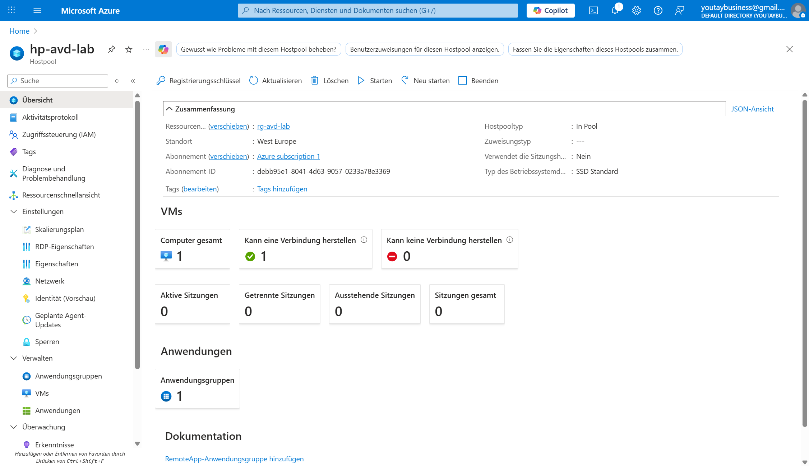
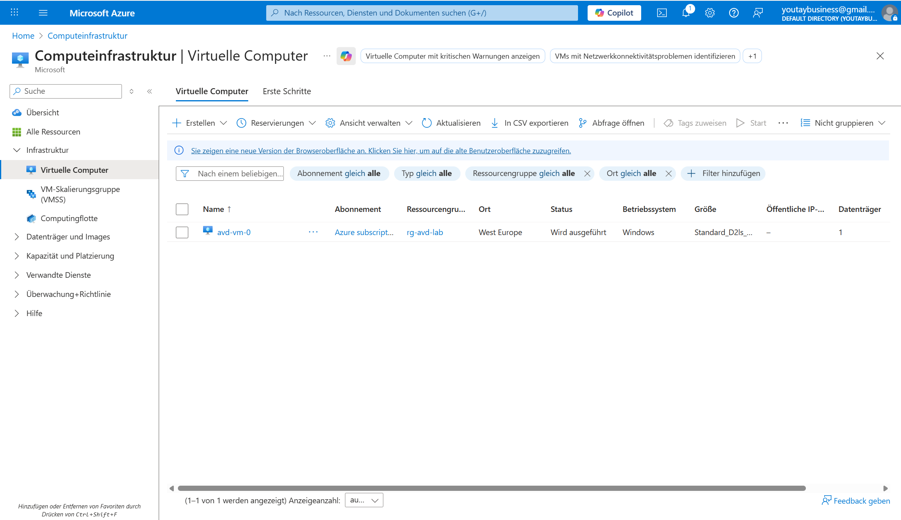
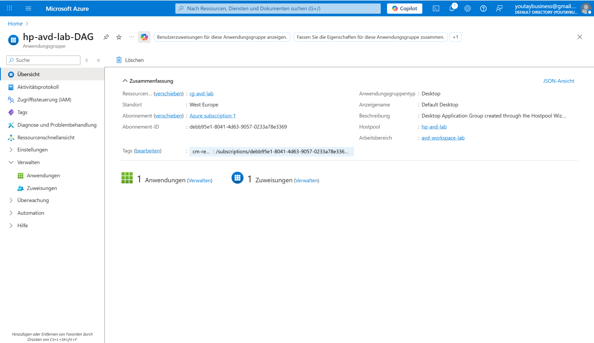
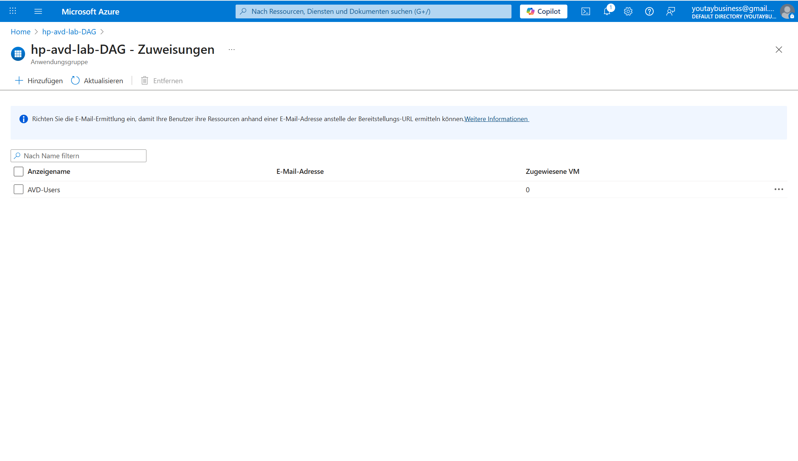
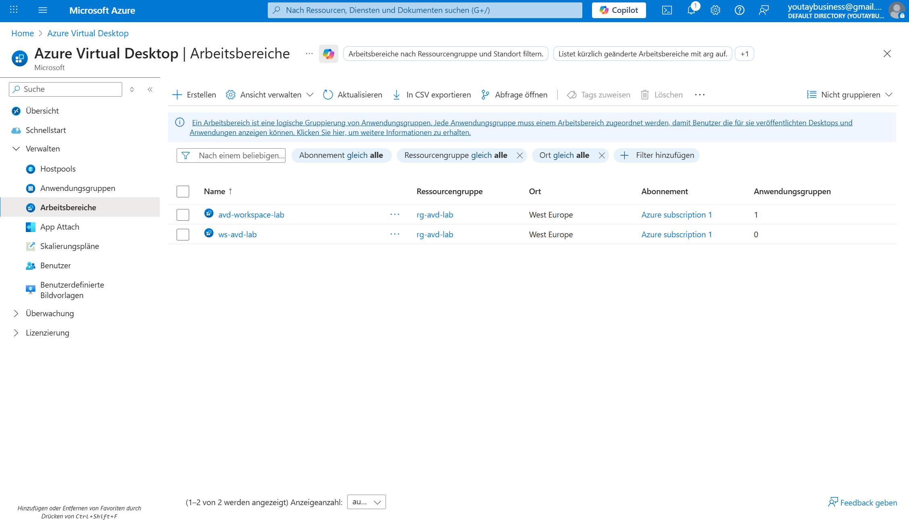
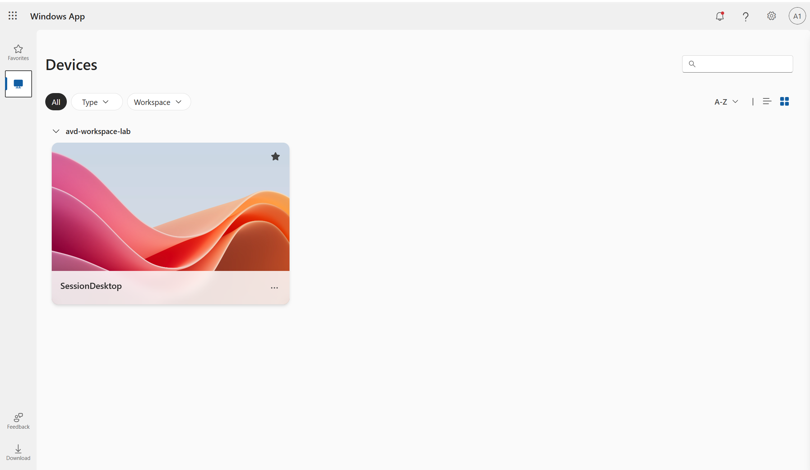

# Azure Virtual Desktop (AVD) – Lab Project

## Overview
This project demonstrates a complete **Azure Virtual Desktop (AVD)** setup using Azure native services.
The goal was to build a secure, cost-optimized virtual desktop environment and understand the full AVD lifecycle.

## Architecture
- Azure Virtual Desktop (Host Pool – Pooled)
- Session Host (Windows 11 Enterprise multi-session)
- Application Group (Desktop)
- Workspace
- Microsoft Entra ID (Azure AD) integration
- Azure Virtual Network (VNet + Subnet)

## What I built
- Created an **AVD Host Pool** (Pooled)
- Deployed a **Session Host VM** in Azure
- Configured **Application Group** and **Workspace**
- Assigned users via **Microsoft Entra ID group**
- Connected successfully using **Windows App (web)**

## Skills demonstrated
- Azure Virtual Desktop fundamentals
- Virtual machines & networking (VNet, Subnet)
- Identity & access management (Entra ID)
- Secure remote access (no public inbound ports)
- Cost-aware Azure architecture (Free tier friendly)

## Why this is relevant
Azure Virtual Desktop is widely used for:
- Secure remote work
- Enterprise desktops
- Cost-optimized VDI solutions

This project shows practical, hands-on experience beyond theory.

## Screenshots

### 1. Host Pool Overview
AVD Host Pool (Pooled) with session host configuration.

### 2. Session Host Virtual Machine
Deployed Windows 11 Enterprise multi-session VM acting as session host.

### 3. Application Group (Desktop)
Desktop Application Group linked to the host pool.

### 4. Application Group – User Assignment
Microsoft Entra ID group assigned to the Desktop Application Group.

### 5. Workspace
Workspace used to publish the desktop to end users.

### 6. Successful User Login
Successful login to Azure Virtual Desktop using Windows App (web).

## Status
✔ Deployment completed  
✔ User login tested successfully  

